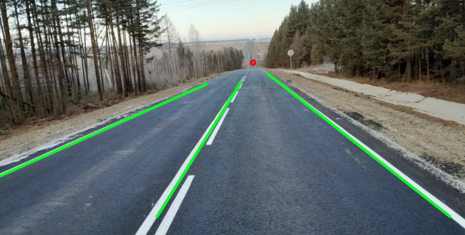
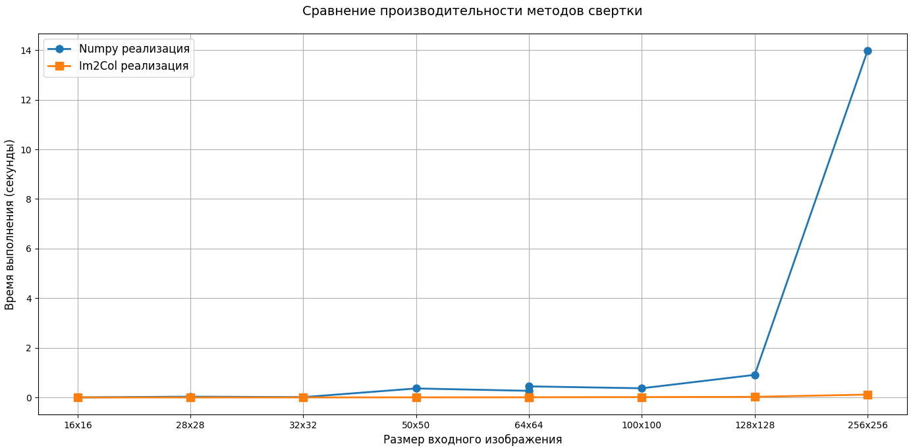

# CV-masters-seminars
## Лабораторная работа №1.
Необходимо найти полосы движения на изображении ```/lab_1/road1.png``` и точку схода данных полос.


## Лабораторная работа №2.
Реализовать поэлементную свертку и свертку с Im2Col.

